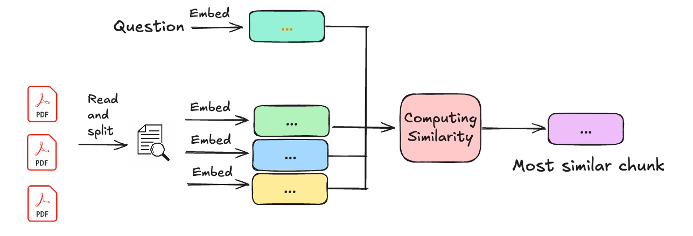

# Building a RAG application from scratch

The goal of this project is to build a system that loads and reads multiple PDFs and enable users to interact with it through questions. It's built using LangChain, GPT4, LLaMA and a simple RAG (Retrieval-Augmented Generation) application using Pinecone and OpenAI's API. The application will allow you to ask questions about any company PDF




## Content

1. main_detailed.ipynb: This is just a testing notebook

2. main.ipynb. Main notebook that centralizes all encapsulated functions built within the other .py files.

3. Streamlit: Amazing app created by Miguel to make it easier for users to play around with the model.

### Short tutorial on how to run it:


## Setup

1. Create a virtual environment and install the required packages:

```bash
$ python3 -m venv .venv
$ source .venv/bin/activate
$ pip install -r requirements.txt
```

2. Create a free Pinecone account and get your API key from [here](https://www.pinecone.io/).

3. Running it locally: Create a `.env` file with the following variables:

```bash
OPENAI_API_KEY = [ENTER YOUR OPENAI API KEY HERE]
PINECONE_API_KEY = [ENTER YOUR PINECONE API KEY HERE]
PINECONE_API_ENV = [ENTER YOUR PINECONE API ENVIRONMENT HERE]
```

4. Running it on streamlit: Make sure you enter the keys above in the secrets folder of streamlit. E.g:

OPENAI_API_KEY="api"
PINECONE_API_KEY="api"


## Theoretical explanation

1. **main_detailed.ipynb**: Creating a RAG with an In-Memory Vector Database. This notebook shows how to build a RAG (Retrieval-Augmented Generation) with a local in-memory vector store. It also demonstrates how to run OpenAI models with LangChain.

   ### Content:
   - Running an LLM
   - Loading PDF Documents
   - Prompt Engineering
   - Creating a Local In-Memory Vector Database
   - Testing End-to-End RAG


---

## Models

### OpenAI:
```python
from langchain_openai.chat_models import ChatOpenAI

MODEL = "gpt-4o-mini"
model = ChatOpenAI(api_key=os.getenv("OPENAI_API_KEY"), model=MODEL)
```

### LLaMA:
```python
from from langchain_ollama import OllamaEmbeddings, OllamaLLM

MODEL = ""
model = ChatOpenAI(api_key=os.getenv("OPENAI_API_KEY"), model=MODEL)
```
## Embeddings
```
from langchain_openai.embeddings import OpenAIEmbeddings

#### Using the default model
embeddings = OpenAIEmbeddings(api_key=os.getenv("OPENAI_API_KEY"))

#### Specifying a custom embedding model
embeddings = OpenAIEmbeddings(
    api_key=os.getenv("OPENAI_API_KEY"), model="embedding_model"
)
```
## Vector Stores

#### For the following examples, we use a document loader to load a document and split it into pages:
```
from langchain_community.document_loaders import TextLoader
from langchain.text_splitter import RecursiveCharacterTextSplitter

text= ""
    for pdf in pdf_docs:
        pdf_reader = PdfReader(pdf)
        for page in pdf_reader.pages:
            text += page.extract_text()

text_splitter = RecursiveCharacterTextSplitter(chunk_size= 500, chunk_overlap = 30)
chunks = text_splitter.split_text(text)

```
## Local In-Memory Vector Store
#### For the following examples, we use a PDF document loader to load a document and split it into pages:
```
from langchain_community.vectorstores import DocArrayInMemorySearch

vectorstore = DocArrayInMemorySearch.from_documents(
    pages,
    embedding=embeddings
)
retriever = vectorstore.as_retriever()
retriever.invoke("Information to retrieve")
```
## Retrievers

#### The VectorStoreRetriever class wraps vector stores to allow easy querying. Some configuration options include:
```
search_type: Type of search to perform ("similarity" (default), "mmr", or "similarity_score_threshold")

search_kwargs: Additional arguments to pass to the search function

k: Number of documents to return (default is 4)